[TOC]

# 1.计算机系统知识

## 1.1原码反码补码移码

正数时

> 原=反=补

负数时

> 原转反：符号位不变，其余取反
>
> 反转补：最低位加1

移码：当偏移量为2的n-1次方时，**将补码符号位取反即可**

**零只有唯一补码**

## 1.2定点数浮点数

浮点数表示方法

```math
N = M*R^E
```

M为尾数，R为基数，E为阶码

## 1.3校验码

**确保数据传送无误**

> - 提高硬件电路的可靠性
> - 提高代码的检验能力


**奇偶校验码**：

使码距为2

> - 水平奇偶校验码
> - 垂直奇偶校验码
> - 水平垂直奇偶校验码

**海明码**：在数据位之间插入k个校验码，扩大码距来实现检错和纠错，

设数据位是n位，校验位k位，则满足

```math
2的k次方 -1 >= n+k
```


**循环冗余校验码(CRC)**

校验码越长，该代码校验能力越强，采用模2运算，其加减运算的规则是按位运算，不发生借位和进位

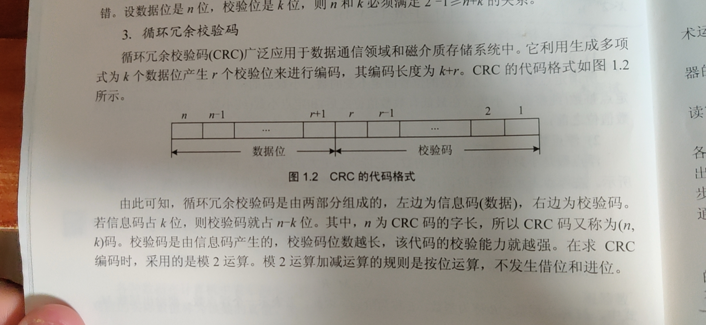

使用模2运算


## 1.4计算机系统硬件组成

**组成**

- 运算器
- 控制器
- 存储器
- 输入设备
- 输出设备

**中央处理单元(CPU)**

主要功能

> - 指令控制
> - 操作控制
> - 时间控制
> - 数据加工

组成

> - 运算器
>
> > - **算术逻辑单元(ALU)**:运算器重要组成部件，负责处理数据，实现对数据的算术运算和逻辑运算
> > - **累加寄存器(AC)**:通用寄存器，当ALU工作时，提供一个工作区
> > - **数据缓冲寄存器(DR)**:在对存储器进行读写操作室，用DR暂时存放由由内存储器读写的一条指令或一个数据字，并将不同时间段内读写的数据隔离开来
> > - **状态条件寄存器(PSW)**:主要分为状态标志和控制标志，这些标志通常分别由一位触发器保存，反映了当前指令执行完成之后的状态。一个算术操作产生一个运算结果，一个逻辑产生一个判决
>
> - 控制器
>
>   它决定了计算机运行过程的自动化
>
>  > - **指令寄存器(IR)**
>  > - **程序计数器(PC)**
>  > - **地址寄存器(AR)**
>  > - **指令译码器(ID)**
>
> - 寄存器组：控制器和运算器中的寄存器都是专用寄存器，通用寄存器可由程序员规定其用途

## 

## 1.5存储系统

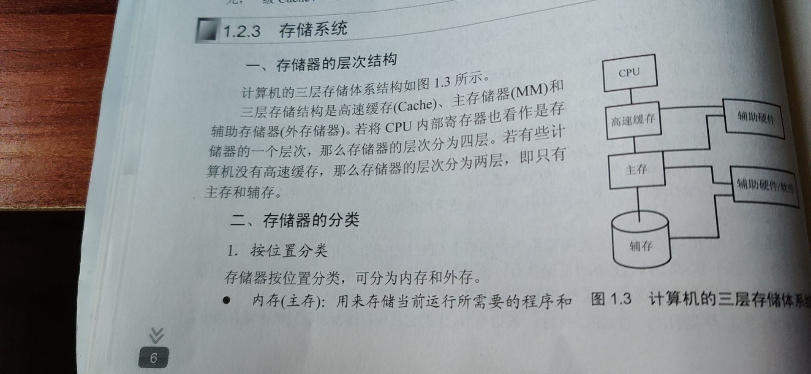

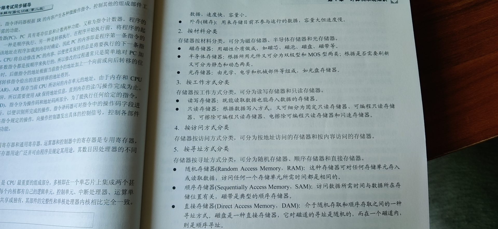

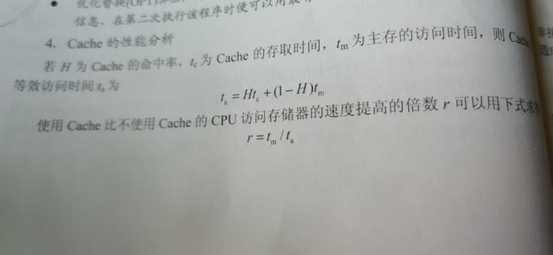


**相联存储器**：按内容访问的存储器，通过关键字比较，可用在高速缓冲存储器中，在虚拟存储器中用来做段表等，还可用在数据库中

**高速缓存(Cache)**

目的：提高存储器平均访问速度，使存储器速度与cpu速度相匹配，地址变换和数据块的替换算法均由**硬件**实现。通常被集成到cpu的寄存器中，容小，速快，成高


常用的虚拟存储器由**主存-辅存**组成


## 1.6输入输出技术


1.7**总线结构**


系统总线：ISA,EISA,PCI

外部总线：PS-232-C,SCSI,USB,IEEE-1394


## 1.8指令系统

**CISC和RISC**


**吞吐率**


## 1.9题目总结

1. cache与主存的地址映像由**硬件**自动完成
2. 指令寄存器位数取决于**指令字长**
3. 逻辑异或：相等结果为0否则结果为1
4. 计算机字长32位，内存容量2GB，按字编址，寻址范围为**2GB/32位**
5. 常用虚存储器由**主存-辅存**组成
6. 中断向量可提供**中断服务程序的入口地址**
7. 实现多级中断嵌套，使用**堆栈**保护断点和现场
8. CRC格式为k+r
9. 定点表示法，**小数点不用存储位**
10. 某无条件转移汇编采用**直接寻址**，则该指令功能将指令中的地址码送入**PC(程序计数器)**
11. IO接口与主存采用**统一编址**，则输入输出操作是通过**访存**来完(统一编址是指IO端口与主存使用同一个地址空间进行统一编址)
12. **总线复用**，指数据和地址在同一个总线上传输的方式，可以**减少总线中信号线的数量**
13. CPU寄存器中，**指令寄存器**对用户是完全透明的

# 2.程序语言基础知识


## 2.1编译过程


**前端部分(与机器无关)**

> 词法分析，语法分析，语义分析，中间代码生成

**后端部分(与机器有关)**

> 代码优化，目标代码生成

**传值调用：**实参向形参传递相应类型的值，这种方式形参不能向实参传递信息。在C语言中，要实现被调用函数对实参的修改，**必须用指针作形参**。即调用时先对实参进行取地址运算，然后将实参地址传递给指针形参。这种方式实现了间接访问内存

**引用调用：**是c++增加的数据类型，当形参为引用类型时，**形参名实际上是实参的别名**，函数中对形参的访问和修改实际上就是针对相应实参所做的访问和改变

**实参可以使常量变量或表达式**

**常用中间代码有**：后缀式，三元式子，四元式和树

## 2.2文法


## 2.3有限自动机


## 2.4正规式


## 2.5表达式


## 2.6语言特点


## 2.7题目总结

1. 将高级语言翻译为机器语言程序的过程中，常引入**中间代码**，好处是**有利于进行与机器无关的优化处理，以及提高编译程序的可移植性**
2. 对高级语言源程序进行编译过程中，有穷自动机(NFA或DFA)是进行**词法分析**
3. 弱类型语言指不需要进行变量或对象类型声明的语言，例如**python**
4. **编译程序**和**解释程序**的相同点：在词法，语法，语义分析方面工作原理基本相同。不同点：在运行用户程序时，**解释程序**直接执行源程序或源程序的内部形式(中间代码)，因此不产生目标程序，而**编译程序**将源程序翻译成**目标程序**
5. 在对高级语言源程序进行编译过程中，为源程序变量所分配的存储单元的地址属于**逻辑地址**
6. 声明语句和可执行语句，对**声明语句**，主要是将需要的信息正确的填入合理组织的**符号表**中，对**可执行语句**，**则是翻译成中间代码或目标代码**
7. 
8. 
9. 
10. 
11. **数据类型说明**
    - 说明数据占用的内存和存放形式以分配存储单元
    - 对参与计算的对象进行检查
    - 规定数据的取值范围及能够的运算

# 3.操作系统知识

## 3.1基础知识


**特征**

1. 并发性
2. 共享性
3. 虚拟性
4. 不确定性

**功能**

1. **处理机管理**：对处理机执行时间管理，采用多道程序等技术将CPU合理分配每个人物。常用资源管理单位有**进程**和**线程**
2. **文件管理**
   1. 文件存储空间
   2. 目录
   3. 文件的读写
   4. 存取控制
   5. 软件
3. **存储管理**：对主存空间管理
4. **设备管理**：方便设备使用，提高CPU和I/O设备的利用率
5. **作业管理**
   1. 任务管理
   2. 界面管理
   3. 人机交互

**类型**

1. **批处理操作系统**
2. **分时操作系统**
3. **实时操作系统**
4. **网络操作系统**
5. **分布式操作系统**
6. **微机操作系统**
7. **嵌入式操作系统**

## 3.2处理机管理

### 3.2.1前趋图

### 3.2.2进程的同步与互斥


### 3.2.3PV操作

**定义**


**例题**


**PV操作与前趋图**


### 3.2.4进程调度

**分类**

- 可剥夺式
- 不可剥夺式

**算法**

1. **先来先服务(FCFS)**：总是将就绪队列队首的进程投入运行，特点**有利于长作业，不利于短作业，有利于CPU繁忙的作业，不利于I/O繁忙的作业**。宏观调度。
2. **时间片轮转**：提高进程并发性和响应时间，从而**提高资源利用率**。微观调度。
3. **优先级调度**
   1. 静态优先级：创建时就已经确定好，知道进程终止都不改变
   2. 动态优先级：可以改变
4. **多级反馈调度**：照顾短进程，提高系统吞吐量，缩短平均周转时间，照顾I/o型进程以获得较好的I/O设备利用率，缩短响应时间

### 3.2.4死锁

**原因**

- 资源竞争
- 进程推进顺序非法

**产生死锁的4个必要条件**

- 互斥条件:一次只允许一个进程使用
- 请求保持条件：获得后又请求资源被堵塞
- 不可剥夺条件：进程在未结束前不能所获得的资源不能被剥夺
- 环路条件：每个进程占有下个进程申请的资源

**死锁处理**

- 预防：破坏4个条件中一个，措施是**静态分配法**和**资源有序分配法**
- 避免：银行家算法
- 检测：系统定时运行死锁检测程序
- 解除
  - 资源剥夺法
  - 撤销进程法

### 3.2.5线程

比进程小，是进程的实体，是系统独立分配和调度的基本单位，也有就绪，阻塞，运行三种状态

### 3.2.6银行家算法

缺

- 银行家算法
- 银行家例题1
- 银行家例题2
- 银行家例题3

## 3.3存储管理

### 3.3.1分配算法

缺

- 存储分配算法

### 3.3.2页，段，段页式存储

**页式存储**

缺

- 页式存储
- 页式存储练习题

**段式存储**

缺

- 段式存储

**段页式存储**

缺

- 段页式存储

**快表**

如果题目没有使用块表，则程序要访问**2**次内存，第一次是查表，第二次是查到后访问对应的块

缺

- 块表

### 3.3.3页面置换算法

**缺页**

访问内存时没有想要访问的页面，此时产生一次缺页

**抖动**

分配页面更多反而缺页率更高

缺

- 分配算法例题.jpg

### 3.3.4页面淘汰算法

指令跨页时产生一次缺页中断，操作数跨页会产生两次缺页中断

缺

- 页面淘汰算法练习题

## 3.4文件管理

### 3.4.1文件和树形目录结构

主要考察绝对路径和相对路径

缺

- 文件和树形目录结构.jpg

### 3.4.2空闲存储空间管理

**位示图法**

字长代表一个字有多少个物理块

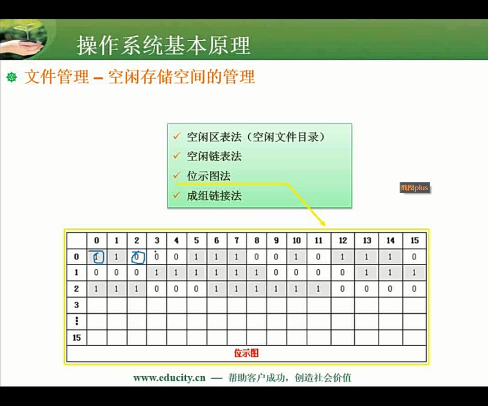

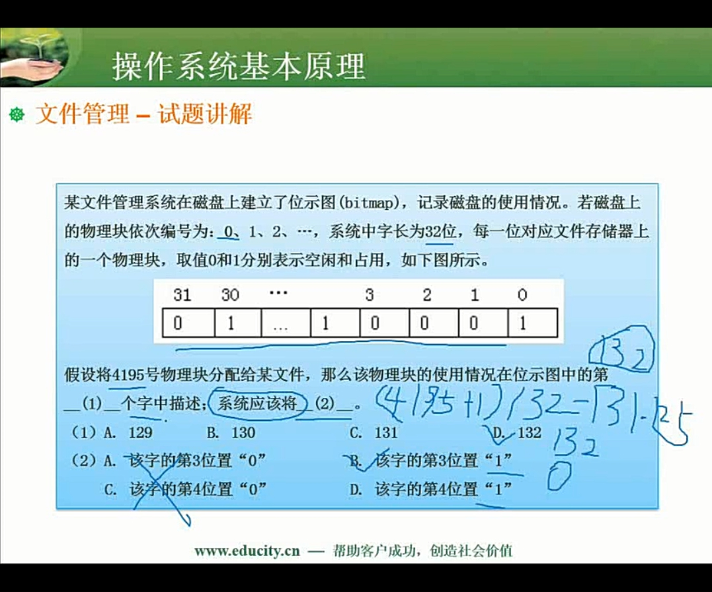


### 3.4.3索引文件结构

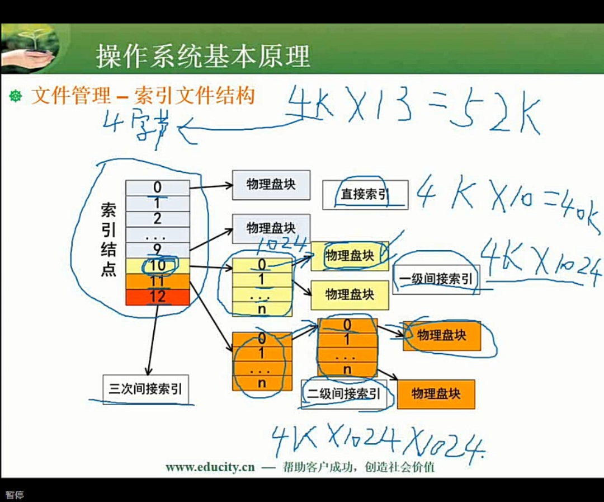

例题

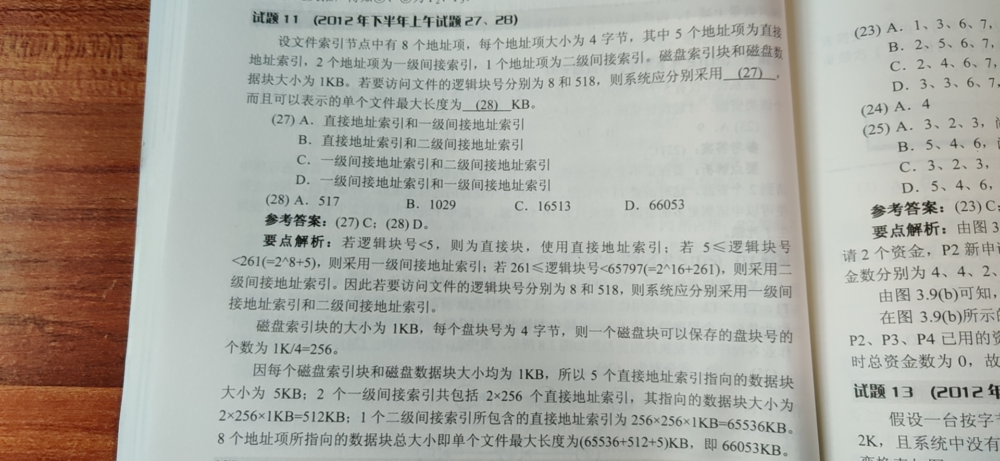


## 3.5设备管理

### 3.5.1数据传输控制方式

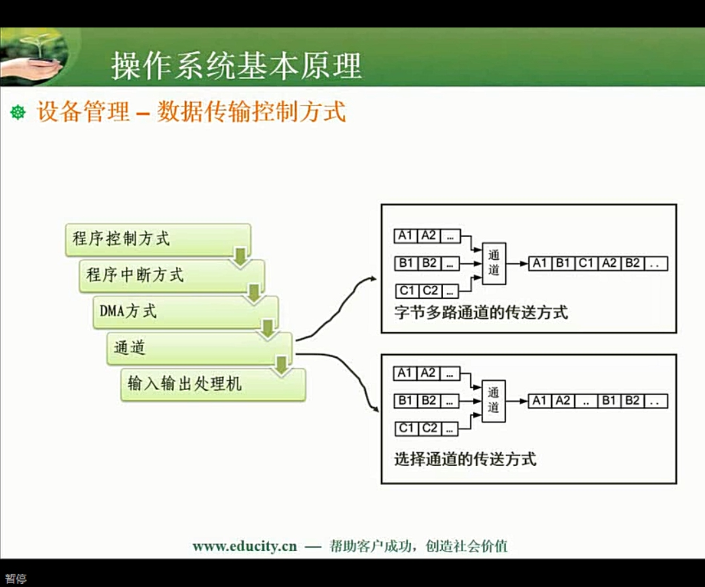


### 3.5.2虚拟设备和spooling技术

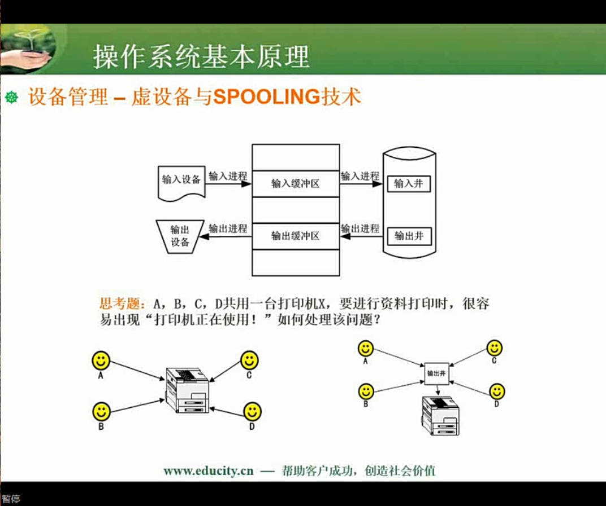


### 3.5.3磁盘调度

**算法**

1. 扫描算法：从里到外，然后再从外到里
2. 单向扫描算法，从里到外后到最外面是，再从最开始的里面到外面

例题

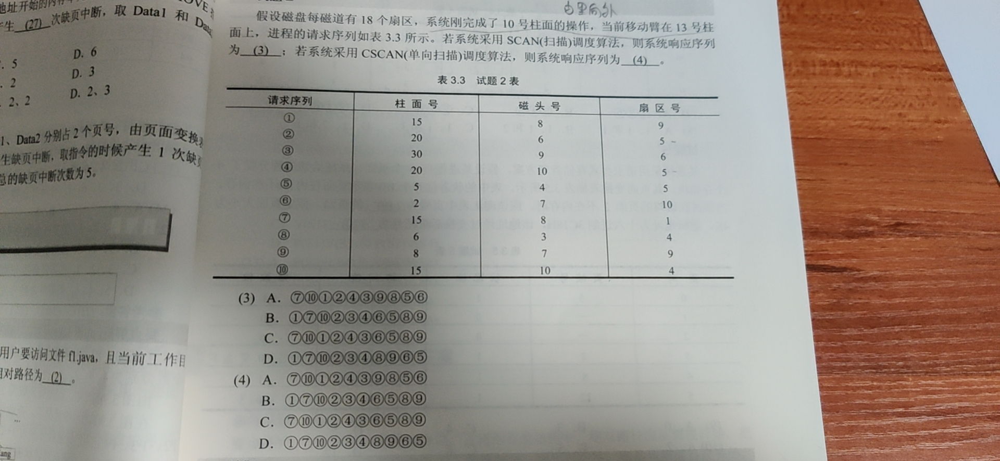

解析

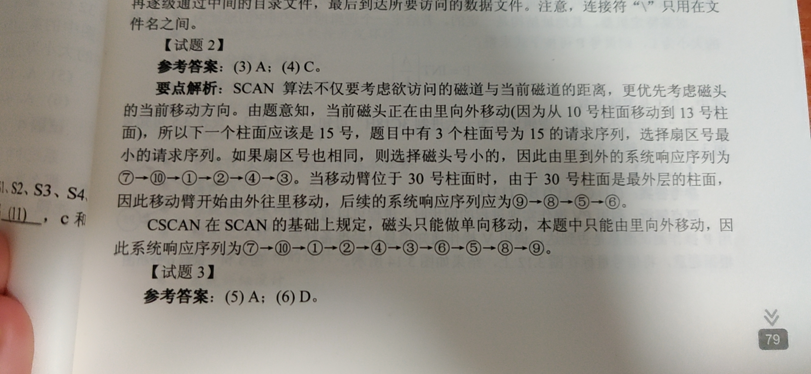

## 3.6作业管理

**组成**

- 程序
- 数据
- 作业说明书：体现用户的控制意图

**作业控制**

- 脱机：无需人工干预，用户必须提交作业说明书
- 联机：需要人工干预，用户可以通过终端提交意图

**作业状态及其转换**

- 提交
- 后备：通过spooling系统
- 执行
- 完成：通过spooling系统输出

**作业调度算法**

- 先来先服务(FCFS)
- 短作业优先(SJF)
- 响应比高优先
- 优先级调度算法
- 均衡调度算法

## 3.7题目总结

1. 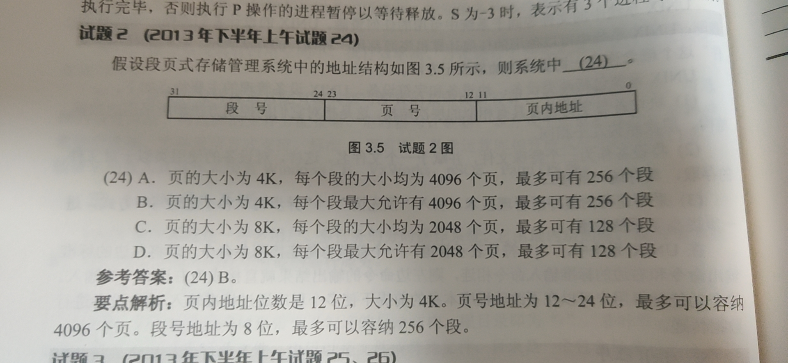
2. 

   

# 4.系统开发和运行

## 4.1基础知识

### 4.1.1开发模型

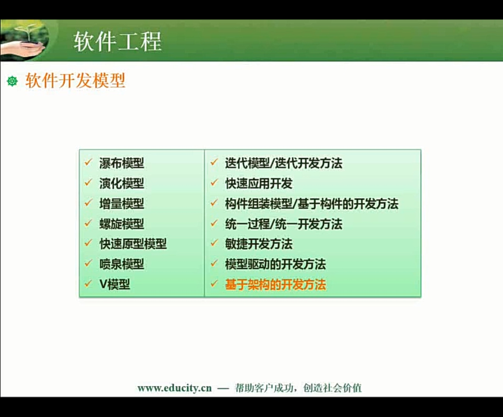

**瀑布模型**

> **需求明确**，时间严格，二次开发时选用，无法灵活应对需求

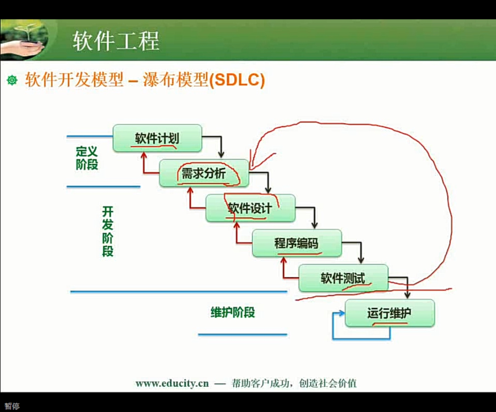

**演化模型**

> 根据需求快速开发一个可运行版本，然后不断改进，**主要用于对软件需求缺乏准确认识**

**螺旋模型**

> 包括
>
> 1. 制定计划
> 2. 风险分析
> 3. 实施工程
> 4. 客户评估
>
> 瀑布模型和演化模型的结合，在这之上增加了风险分析

**喷泉模型**

> 以用户需求为动力，以对象作为驱动，主要用于描述面向对象的开发过程，具有迭代和无间隙特性，适合==面向对象==开发，各开发活动==没有明显界限==

**V模型**

强调测试的模型，测试贯穿始终


### 4.1.2软件开发方法

1. **结构化方法**

   > 面向**数据流**，自顶向下，逐层分解，最早出现的方法，适合于数据处理领域问题，不适合解决大规模复杂的项目，难以适应需求的变化

   

2. **Jackson**方法

   > 面向**数据结构**，以数据结构为驱动

   

3. **原型化方法**

   > **适合需求不明确时**

   

4. **面向对象开发方法**

   > 统一建模语言UML

### 4.1.3软件需求分析

> 1. 功能需求：所开发软件必须有的功能
> 2. 非功能需求：如可靠性，响应时间，容错性，扩展性，吞吐量，价格等
> 3. 设计约束：限制条件，补充规约

### 4.1.4软件开发项目管理

1. 成本估算

2. 风险分析

   > 1. 风险识别：建立风险条目检查表
   > 2. 风险预测：
   > 3. 风险评估：三元组，定义风险参照水准
   > 4. 风险控制：避免

3. 进度管理
   1. **Gantt图**：横坐标时间，纵坐标任务，**能清晰的描述任务何时开始何时结束以及各个人物的并行性，不能反映任务的依赖关系，难以确定项目的关键**
   2. **PERT图**：不仅有上面的优点，**还给出了任务间的关系**，==不能反映并行关系==

4. 人员管理

### 4.1.5软件配置管理

1. 基线
2. 软件配置项
3. 版本控制
4. 变更控制

### 4.1.6软件过程管理

`软件能力成熟度模型(CMM)`

> 1. 初始级：无序混乱
> 2. 可重复级：建立了基本的项目管理
> 3. 已定义级：已将软件管理和工程过程文档化，标准化
> 4. 已管理级：收集对软件过程和产品质量的详细度量
> 5. 优化级：过程的量化反馈和先进的思想
>

`统一过程模型(UP)`

用例和风险驱动，以架构为中心，迭代并且增量

四个阶段

> 1. 初始阶段：生命周期目标
> 2. 精化阶段：生命周期构架
> 3. 构建阶段：初始运作功能
> 4. 移交阶段：产品发布
>

典型代表**RUP**

`敏捷开发`

总体目标：尽可能早地，持续地对有价值的软件的交付

> 1. 极限编程(XP):轻量级高效，4大价值观..
> 2. 水晶法(Crystal):每一个不同的项目都需要一套不同的策略，约定和方法论
> 3. 并列争球法(Scrum):使用迭代，==按需求的优先级别来实现产品==
> 4. 自适应软件开发(ASD):有一个使命，特征为视为客户家辉的关键点

### 4.1.7软件质量管理

**软件质量特性**

> 1. 功能性：与一组功能及其指定的性质有关的一组属性
> 2. 可靠性：一定时间，软件维持其性能水平有关
> 3. 易使用性：为使用软件使用的努力
> 4. 效率：规定条件下，软件性能水平与所用资源量关系
> 5. 可维护性：进行规定修改所需努力
>    1. 易分析
>    2. 易改变
>    3. 稳定性
>       1. 易测试性：与为确认经修改软件所需努力
> 6. 可移植性：到另外环境的能力
>

**软件质量保证**

**软件复杂性**

度量方法

1. 代码行度量方法：统计程序的源代码行数，以此来为指标
2. McCabe度量法：取决于控制的复杂性

**软件评审**

**软件容错技术**

实现手段主要是**冗余**

1. 结构冗余
2. 信息冗余
3. 时间冗余
4. 冗余附加技术

## 4.2系统分析

## 4.2.1结构化分析方法

> 面向数据流的需求分析方法，适用于分析大型数据处理系统

`数据流图`

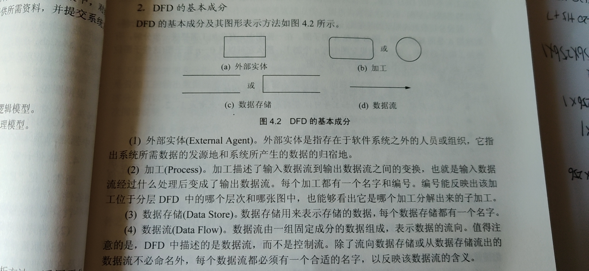

分层

> 1. 顶层数据流图：描述了系统的输入输出
> 2. 0层图：加工输入流
> 3. 内部：加工

## 4.3系统实施

### 4.3.1测试策略和方法

`黑盒测试`

> 1. 等价类划分：选出代表性数据来测试
> 2. 边界值分析
> 3. 错误推测
> 4. 因果图：从自然语言描述的程序规格找出因和果，制成判定表

`白盒测试`

> 1. 逻辑覆盖
>    1. 语句覆盖：使所有语句都被覆盖，==最弱的逻辑覆盖==
>    2. 路径覆盖：所有路径都会执行到
>    3. 判定覆盖
>    4. 条件覆盖
>    5. 判定/条件覆盖
> 2. 循环覆盖：使循环中每个条件都得到验证
> 3. 基本路径测试

## 4.4题目总结

1. `数据流图守恒加工原则如下`

   > 1. 加工规格说明必须描述输入变为输出数据流的加工规则
   > 2. 决策表可以用来表示加工规格说明
   > 3. 对同一个加工来说，输入与输出名字必须不相同
   > 4. 加工规格说明主要目的是说做什么而不是怎么做的具体流程

2. `模块作用范围超过控制范围时`

   > 1. 通常采用向上移动判断点位置
   > 2. 将受判定影响的模块下移到控制范围内

3. `活动图`

   > 1. ==关键路径==：从开始到结束得所有路径中，所用时间最长的一条为关键路径。
   >
   >     ==最早开始时间==：在关键路径上，从开始到该任务的最早执行的时间
   >
   >     ==最晚开始时间==：关键路径的总时间-反向得出该任务的时间
   >
   >    2.==松弛时间==（最多延迟执行的时间）
   >
   >    最晚开始时间-最早开始时间 

   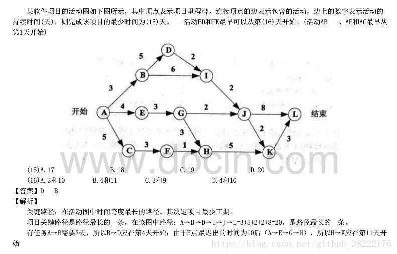

4. `增量式优势`

   > 1. ==较短时间内==提供有用的产品，能够解决用户急用功能
   > 2. 只提交用户==部分功能==，用户有充足时间学习和适应
   > 3. 需求变更时只变更部分部件，==而不必影响整个系统==

5. `程序质量评审`
   从开发者角度评审，着眼于==软件本身结构==，==与运行环境的接口==，==变更带来的影响==，==模块结构==主要包括以下(不包括==数据结构==)

   > 1. 控制流结构
   > 2. 数据流结构
   > 3. 模块结构与功能结构之间的对应关系
   > 

6. `系统可维护性的评价指标`

   不包括==可移植性==

   > 1. 可理解性
   > 2. 可测试性
   > 3. 可修改性
   > 4. 维护工具
7. `逆向工程`

   通常在原软件生命周期的==软件维护==阶段进行

8. `等价类划分测试`

   把所有可能输入的数据作为测试用例，再在输入时不要输入两个错误用例，否则无法判断

9. `单元测试主要检查内容`

   > 1. 边界测试
   > 2. 错误处理测试
   > 3. 路径测试
   > 4. 局部数据结构测试
   > 5. 模块接口测试

10. `领域类模型`

    对领域内的概念类，现实世界的可视化表示，不包含==操作==

11. PERT图==不能清晰地描述任务间的并行关系==

12. 修改错误后，还需要==回归测试==以发现修改是否引起原本正确发生错误

13. 

    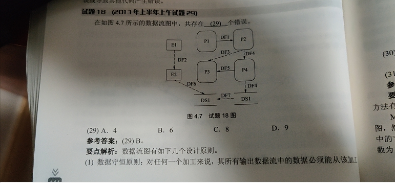
    	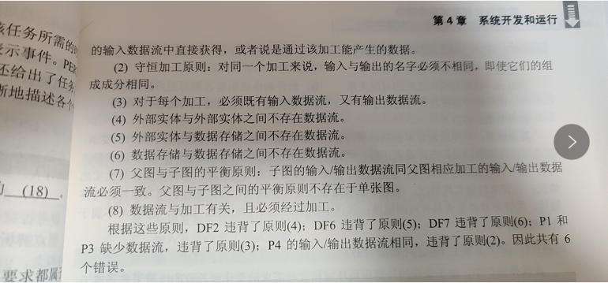


14. `McCabe计算`

    公式:V(G)=m-n+2,m为==边数==，n为==节点数==，可以用三个节点两条边来验证

    如果有一条边没有连接两个点，这个边不用算

    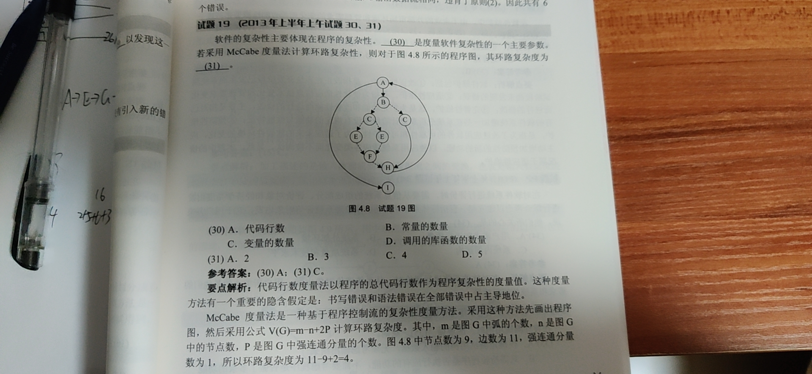

15. `单元测试需要考虑`

    > 1. 输入参数是否与形式参数是否一致
    > 2. 全局变量的定义在各模块是否一致
    > 3. 输入是否改变了形式参数
    > 4. 调用其他模块的参数与被调用的模块的参数是否一致

16. 划分模块原则，一个模块作用范围应该在其控制范围之内，控制范围==完全==取决于系统的结构

17. `冗余附加技术`

    包括程序，指令，数据，空间和通道

    > 1. 屏蔽==硬件错误==
    >    1. 关键程序和数据的冗余存储及调用
    >    2. 检测，表决，切换，重构，纠错和复算的实现
    > 2. 屏蔽==软件错误==
    >    1. 冗余备份程序的存储及调用
    >    2. 实现错误检测和错误恢复的程序
    >    3. 实现容错软件所需的固化程序

18. 模块内聚

    > 1. 逻辑内聚：模块内几个逻辑相似功能的模块，通过参数确定执行哪个
    > 2. 顺序内聚：一个模块中各个处理元素都密切相关同一功能且必须顺序执行，前一功能的元素的输出就是下一功能的输入
    > 3. 功能内聚：模块内所有元素完成一个功能

19. ==无主程序员组==成员相互平等，工作由共同讨论，有利于发挥个人积极性，但职责不明，不适合开发大规模项目

20. 项目组对风险主动，则==风险避免==最好

21. 产品运行方面的质量特性不包括==灵活性==，这属于产品修正方面的特性

22. 利用结构化分析模型进行接口设计时，应以==数据流图==为依据

23. 用户数据隔开有关于==安全性==，所以考虑了软件特性的==功能性==

24. `数据流图`

    > 1. 加工到数据存储不算==缺失的数据流==，有箭头但没文字不算==缺失的数据流==


# 5.网络基础知识

## 5.1网络的拓扑结构

> 1. 总线结构：只有一条双向通路，属于==分布式控制==，==节点的增删和位置的改动==较容易，，节点接口采用==无源电路==，设备少价格低，对信号质量要求高
> 2. 星形结构：以==放射状==连接节点，，特点维护管理容易，故障隔离和检测容易
> 3. 环形结构：信息流动方向固定，系统响应速度慢
> 4. 树形结构：总线结构的扩充形式
> 5. 分布式结构：各节点之间多条线路相连，资源共享方便，网络响应时间短

## 5.2ISO/OSI网络体系结构

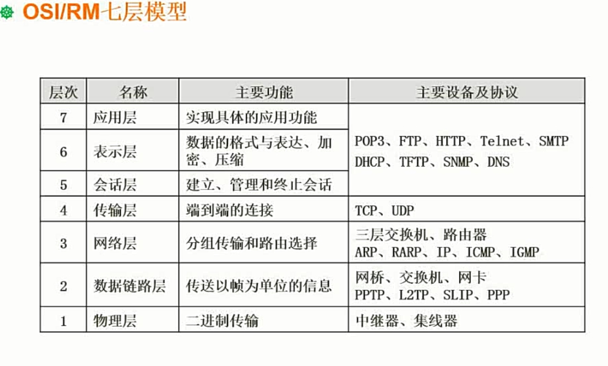


### 5.2.1网络互联硬件

`物理层互联设备`

> 1. 中继器：为保证有用数据的完整性，用中继器把所接收到的弱信号进行分离，并再放大
> 2. 集线器：特殊的中继器，使用双绞线

`数据链路层互联设备`

> 1. 网桥：一个局域网到另一个局域网的建立的桥梁，，作用==扩展网络和过滤帧==
> 2. 交换机：具有高端口密集特点的交换产品，雨荨共享型和专用型的局域网进行带宽调整，以减轻局域网之间信息流通出现的瓶颈问题

`网络层互联设备`

> 路由器：用于连接多个逻辑上分开的网络，具有判断网络地址和选择路径的功能

`应用层互联设备`

> 网关：将协议进行转换，将数据重新分组

### 5.2.2组建网络

> 1. 服务器
> 2. 客户机
> 3. 网络设备
> 4. 通信介质
> 5. 网络软件

## 5.3网络的标准和协议

## 5.4Internet及应用

### 5.4.1Internet地址

> 1. A类：1个字节网络地址，3个主机地址
> 2. B类：2个字节网络地址，2个主机地址
> 3. C类：3个字节网络地址，1个主机地址
> 4. D类：以1110开始
> 5. E类：以1111开始

非类别地址例如：172.18.129.0/==24==，==24==代表在二进制模式下网络地址占多少位，总共==32位==，子网为==2^24^==个，每个子网可使用的主机地址是==2^32^-2==个，2个指的是全0和全1情况

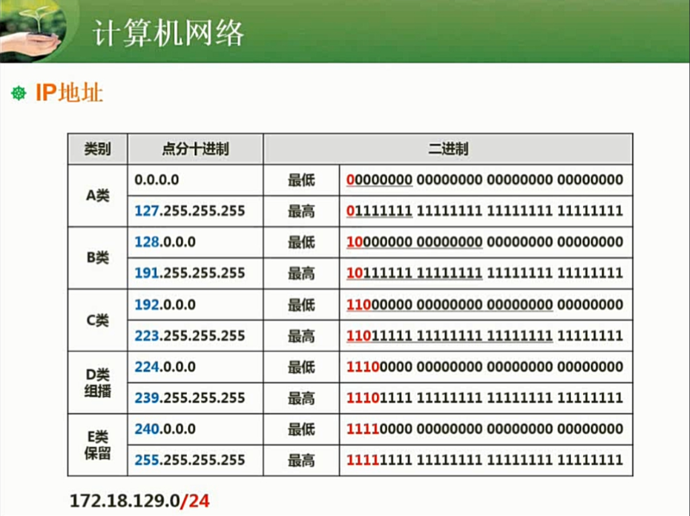

`子网划分`

27个子网，需要5位主机地址来补充，即2^5^，然后把网络地址全为1，主机地址全为0，在转化为十进制就是==子网掩码==

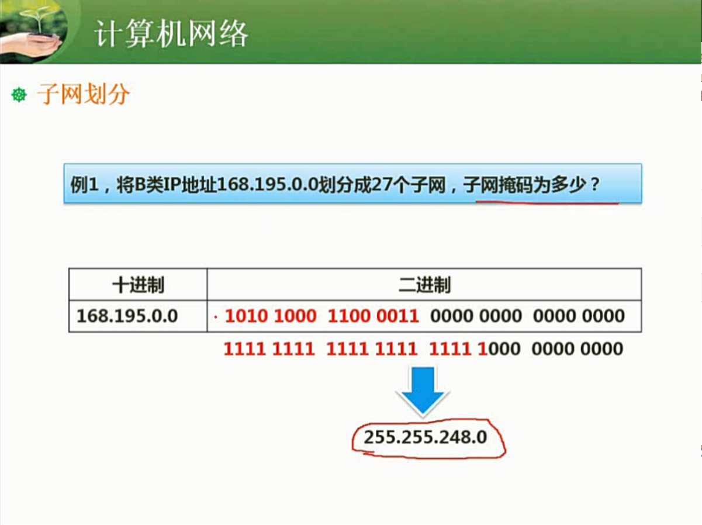

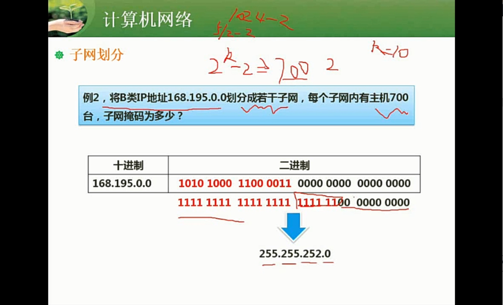

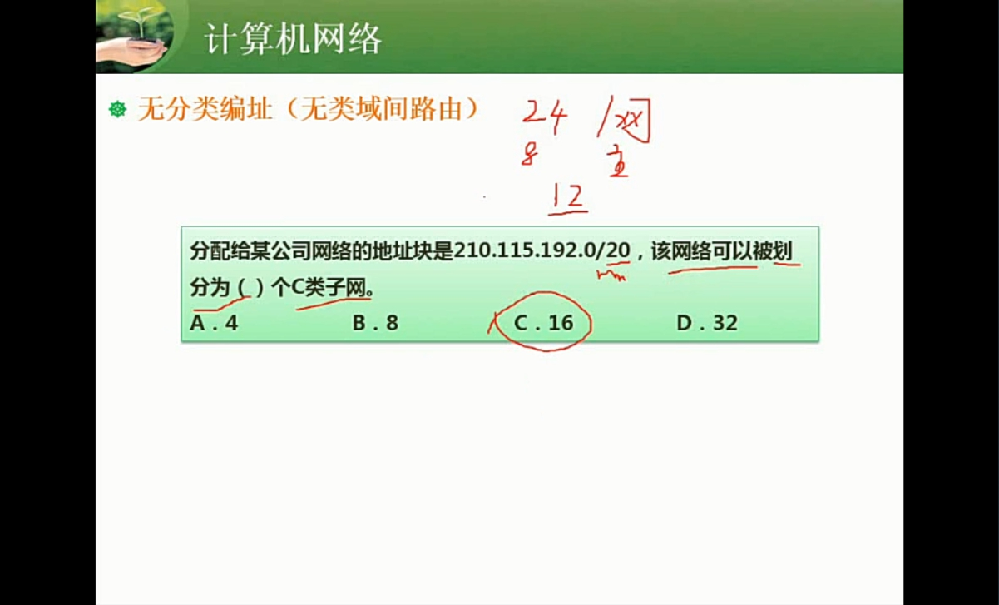

非类最大可表示，让主机地址全为1即能表示的最大

### 5.4.1Internet服务

`DNS域名服务`

> ==域名地址==和==IP地址==等价，通过==域名服务器==，完成映射变换。DNS是一种分布式地址信息数据库系统，用的是==UDP端口==，端口号==53==

`远程登录服务`

> 是在==Telnet协议==的支持下，将用户计算机与远程计算机连接，用的是==TCP端口==，端口号==23==

`电子邮件服务`

> 格式：用户名@主机名。
>
> Email系统
>
> 1. Email客户软件
> 2. Email服务器
> 3. 通信协议
>
> 协议：均使用==TCP端口==
>
> 1. SMTP(邮件传送协议)：端口号==25==
> 2. POP3(邮件接收协议)：端口号==110==

`WWW服务`

> 交互式图形界面的Internet服务，为用户提供超文本传输协议(HTTP),数据文件由==HTML==描述，使用的是==TCP端口==，端口号==80==

`文件传输服务`

> FTP
>
> 1. 客户软件
> 2. 服务器软件
> 3. FTP通信协议
>
> 两条==TCP==连接
>
> 1. 控制连接：主要传输命令和参数，端口号==21==
> 2. 数据连接：主要传输文件，端口号==20==


## 5.5网络安全

### 5.5.1网络安全威胁

> 1. 物理威胁
> 2. 网络攻击
> 3. 身份鉴别：设置口令的手段实现，密码破译
> 4. 编程威胁：通过==病毒==进行攻击
> 5. 系统漏洞：有意设置，使用户在失去访问权依然能进入系统


### 5.5.2攻击手段

> 1. 口令入侵：黑客==用合法用户的账号==登录进行攻击
> 2. 防置特洛伊木马：可以远程控制别人主机
> 3. DoS攻击：即拒接服务，目的是使计算机或网路无法提供正常服务，常见有==计算机网络带宽攻击==和==连通性攻击==。DDos指借助于==客户机/服务器技术==，将多个计算机一起攻击平台
> 4. 端口扫描：利用Socket编程与目标TCP连接
> 5. 网络监听：主机可以接收到本网段在同一条物理通道上传输的所有信息
> 6. 欺骗攻击：创造一个易于误解的上下文环境，诱使被攻击这做出缺乏安全的决策，常见Web，APR，IP欺骗
> 7. 电子邮件攻击

### 5.5.3防火墙

> 建立在内外网络边界上的过滤封锁机制

`分类`

> 1. 包过滤型防火墙：在==网络层==，对于==传输层==，只能识别是TCP还是UDP
> 2. 应用代理网关防火墙：==彻底隔断==内网与外网的直接通信
> 3. 状态检测技术防火墙：在上面基础上加了10倍

`组成`

> 按照受保护程度从高到低，内网>DMZ>外网

### 5.5.4病毒收录

`快乐时光`

> VB源程序病毒，电子邮件的附件

`熊猫烧香`

> ==蠕虫病毒==的变种，更改exe的文件图标

`X卧底`

> ==手机==里的监控软件

`CIH病毒`

> 破坏计算机系统硬件的恶性病毒

`宏病毒`

> 寄存在文档，打开此文档会被感染

`特洛伊木马`

> 秘密潜伏能够通过远程网络进行控制的恶意程序，让受害者为服务端，自己为客户端，从而访问服务端的数据


### 5.5.5安全协议

> 1. PGP：基于PSA公钥加密体制的==邮件加密软件==
> 2. HTTPS：安全基础是==SSL==
> 3. IPSec：使用加密的安全服务以确保在Internet网络上进行保密通信
> 4. SSL：为网络通信提供安全数据，与==TLS==最接近
> 5. TLS


## 5.6题目总结

1. ==PKI体制==中，保证数字证书不被篡改的方法是==用CA的私钥对数字证书签名==

2. `公开密钥加密算法`

   > 1. ECC
   > 2. RSA
   > 3. DSA
   
3. 

   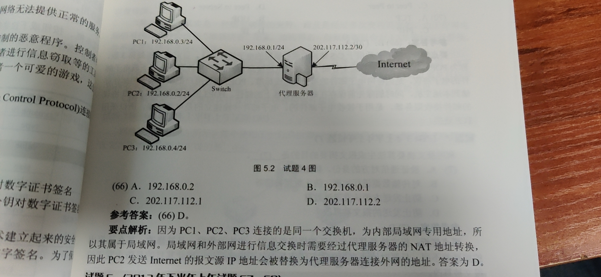

4. `技术`

   > 1. 隧道技术：提供了一种现有IPV4路由体系来传递IPV6的数据方法，即将IPV6包作为无结构意义的数据，封装在IPV4中，被IPV4网络传输
   > 2. 双协议栈技术：==使IPV6与IPV4节点兼容的最直接方式==

   

   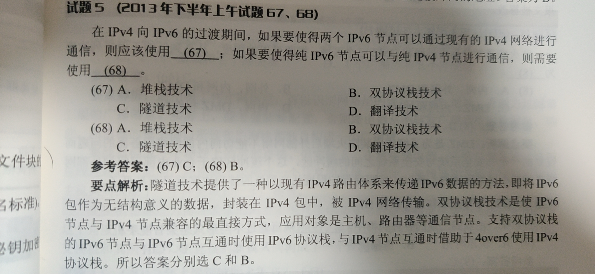

5. ==(POP)POP3协议==

   > 适用于C/S结构的脱机模型的电子邮件协议，是一种规定怎样将个人计算机连接到Internet的邮件服务器

6. 利用==报文摘要算法==生成报文摘要的目的：防止发送的报文被篡改

7. `冲突域和广播域`

   > 1. 集线器：一个冲突域和一个广播域
   > 2. 交换机：多少个主机多少个冲突域和一个广播域

   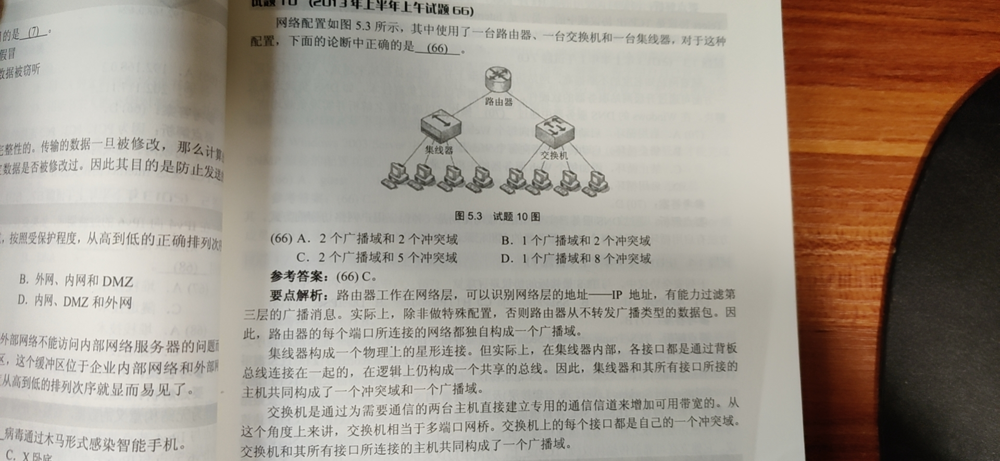

   

8. 通常在UDP协议上的应用是==VOIP==，网页是==HTTP==,==Telnet远程登录==是==TCP==，==邮件==是==SMTP==

9. 通过DNS服务器实现网络负载均衡，方法有==启用循环，添加每个Web服务器的主机记录==

10. 数字证书CA，先从CA获取发送方的数字证书

    > 1. 验证该证书真伪：==用CA的公钥==
    > 2. 验证消息的真实性：==A的公钥==
    > 3. 数字签名：使用CA的秘钥
    > 4. 发送方用==秘钥==加密

11. SNMP服务，需要==administrator==才能

12. `ASP内置对象`

    > 1. request：访问任何用HTTP的信息，包括从HTML表格的POST和GET的参数，cookie和用户认证
    > 2. response：对象控制发送个用户信息，重定向URL，更改cookie的值
    > 3. application：使给定应用程序的所有用户共享信息
    > 4. session：存储特定的用户会话信息

13. DNS更新了域名，需要==刷新缓存==，可以用windows命令==ipconfig/flushdns==

14. 身份验证机制安全级别从小到大

    > 1. 匿名身份验证
    > 2. 基本
    > 3. 摘要式
    > 4. 集成Windows

15. SMTP传输采用==ASCII==格式表示

16. `网络可用性和可靠性`

    > 1. 可靠性：规定时间和条件下，网络系统完成规定功能的能力
    > 2. 可用性：用户可利用网络时间的百分比

17. `建筑物综合布线系统`

    > 1. 工作区子系统：终端到信息插座之间
    > 2. 水平子系统：楼层接线间到工作区
    > 3. 干线子系统：各楼层设备之间的互联系统
    > 4. 园区子系统：连接各个建筑物的通信系统

18. `系统`

    > 1. 漏洞扫描系统：自动检测远程或本地主机安全漏洞的程序，通常指硬件软件等存在安全缺陷。FTP服务器存在可写目录是一个安全漏洞，可以用这个
    > 2. 防火墙系统：专注内部网和外部
    > 3. 入侵检测系统：==对网络传输进行实时检测==
    > 4. 病毒防御系统：防止黑客，病毒，木马

19. TCP使用==三==次握手协议

20. 


# 6.多媒体基础知识

# 7.数据库技术

